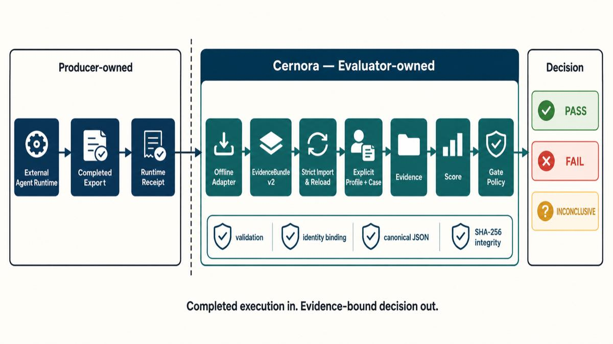

# Cernora

**English** | [简体中文](https://github.com/Yangyang96/cernora/blob/main/README.zh-CN.md)

[](https://github.com/Yangyang96/cernora/actions/workflows/ci.yml)
[](https://pypi.org/project/cernora/)
[](https://pypi.org/project/cernora/)
[](LICENSE)

> **Deterministic, offline evaluation and CI gating for completed AI Agent runs.**

Cernora is an independent evaluation core that verifies a completed Agent run from its
recorded tool calls, returned data, artifacts, and terminal answer. It turns the completed
export into evaluator-owned `Evidence`, `Score`, and `GateDecision` artifacts without starting
the Agent, trusting the Runtime's success claim, or requiring network access.

Use Cernora when you need to:

- prove that an Agent used the expected tools and arguments and grounded its answer in the
  returned evidence;
- turn a frozen Agent export into a reproducible regression or CI/release decision; or
- keep evaluation authority separate from Runtime credentials, sandboxes, retries, and
  self-reported success.

> **Current release:** `0.1.1`, tested on Python 3.12 and 3.13. See the
> [platform matrix](docs/public/compatibility-matrix.md) for operating-system status.
>
> **Development status:** `main` prepares the validated `0.1.2` release candidate with the
> completed Priority 2 Profile authoring loop. It is not published yet; see the
> [product roadmap](ROADMAP.md) for the exact milestone status.

## Try `0.1.1` in five minutes

Cernora supports CPython 3.12 and 3.13.

The production install command is `python -m pip install cernora`. To install this exact
checkout instead of the published release, use the commands below from the repository root.

```bash
python3.12 -m venv .venv
source .venv/bin/activate
python -m pip install .

# Run a complete packaged tool-workflow evaluation
python -m cernora.examples.tool_workflow ./cernora-workflow-run happy-path

# Run the packaged coding evaluation
python -m cernora.examples.coding_evaluation ./cernora-coding-run happy-path
```

Each command prints:

```text
pass
```

The generated `GateDecision` and Preview `EvaluationReport` record why the run passed. The
tool-workflow example contains the equivalent of:

```text
decision: pass
eligible: true
report:
  conclusion: pass
  evaluation_validity: valid
  required_results:
    task_outcome: true
    policy_compliance: true
  diagnostics:
    milestone_coverage: 1.0
    tool_calls: 3
```

The output directory must not already exist. Both examples work from the installed wheel,
use Profile-owned synthetic completed exports, require neither credentials nor a source
checkout, and write and strictly reload a Preview `EvaluationReport`. They validate frozen
evaluation semantics; neither example attests that a real external action or test run occurred.
The coding example additionally reports F2P/P2P rates, build status, candidate and terminal
binding, diff policy, tamper checks, and retry-policy compliance.

## Why Cernora?

A plausible final answer is not proof that an Agent completed a task correctly. The Agent
may have selected the wrong tool, passed the wrong arguments, ignored the returned data,
modified an unexpected artifact, or reported success after its environment failed.

Cernora treats evaluation as a separate authority:

- the **Runtime** owns execution, credentials, sandboxes, retries, and evidence capture;
- an **Adapter** converts one completed native export into a closed `EvidenceBundle v2`;
- a versioned **Profile** validates the evidence and defines required observations;
- Cernora produces a reproducible decision that the Runtime cannot award itself.



See [Architecture](docs/public/architecture.md) for component ownership and trust boundaries.

## Decisions with explicit failure semantics

| Decision | Meaning |
| --- | --- |
| `pass` | Evidence is eligible and every required observation is valid and satisfied. |
| `fail` | Evidence is eligible and proves a behavioral mismatch. |
| `inconclusive` | Evidence, infrastructure, or evaluation authority is missing, corrupt, or incompatible. |

An infrastructure failure never becomes an Agent failure, and unverifiable evidence never
becomes a pass. CLI exit codes preserve the distinction: `0` pass, `1` behavioral failure,
`2` usage/authority incompatibility, `3` invalid or inconclusive evaluation, and `4` a
`profile test` behavioral mismatch or nondeterministic result.

## Engineering highlights

- **Strict versioned contracts:** Pydantic models and published JSON Schemas reject unknown
  fields, unsupported versions, identity mismatches, unsafe paths, and invalid digests.
- **Evidence and authority binding:** producer, run, Profile, Case, fixture, and artifact
  identities remain attached to the decision.
- **Deterministic replay:** canonical JSON, content digests, atomic publication, and strict
  persisted-result reload make repeated evaluation reviewable.
- **Fail-closed composition:** scoring begins only after import eligibility is established;
  missing or invalid observations cannot silently pass.
- **Narrow extension seams:** explicit `Adapter` and `Profile` protocols enable new Runtimes
  and evaluation policies without turning Cernora into an execution framework.
- **Release discipline:** CI tests Python 3.12/3.13, linting, formatting, strict typing,
  distributions, and wheel-only acceptance outside the source checkout.

Content digests establish byte integrity, not producer authentication, non-repudiation, or
immutable history.

## Reference evaluations

| Profile | What it demonstrates |
| --- | --- |
| `offline-workflow` | Exact tool/argument selection, response integrity, and answer grounding against protected fixture evidence. |
| `coding-task` | Candidate export format, content and terminal digest binding, plus evaluator-owned post-terminal checks across backend, frontend, and fail-closed cases. |
| `tool-workflow` | Outcome-first structured results for a stateful synthetic workflow, bound to exact Profile-owned observations; it does not attest a real external action. |
| `coding-evaluation` | Candidate Tree v1 reconstruction, F2P/P2P rates, build and regression outcomes, derived diff policy, tamper checks and terminal binding against exact Profile-owned synthetic capsules. |

Profiles are selected as complete, versioned policies. Individual observations cannot be
disabled at evaluation time, so identical evidence and authority produce identical semantics.
The two new Profiles are opt-in references: adding them does not change existing Profile
behavior or make other Profiles emit structured reports.

## Evaluate your own completed export

The following commands reuse the `EvidenceBundle v2` produced by the five-minute workflow,
then evaluate the strictly persisted package. For your own run, replace `--bundle` with the
bundle path produced by your Adapter and select its matching Profile in both commands:

```bash
cernora evidence import \
  --profile builtin:tool-workflow \
  --bundle ./cernora-workflow-run/bundle/bundle.json \
  --output ./imported

cernora evidence evaluate \
  --profile builtin:tool-workflow \
  --import-root ./imported \
  --output ./evaluated
```

Cernora `0.1.x` accepts EvidenceBundle v2/import v2 only; it never silently converts or
reinterprets legacy bundle formats.

## Extend Cernora

The Preview SDK exposes two intentionally small seams:

- a `Profile` defines authority, import validation, evidence projection, observations, and
  gate policy;
- an `Adapter` converts a completed native export into a canonical `EvidenceBundle v2`.

```python
from cernora import check_adapter_conformance, check_profile_conformance
```

Scaffold a private-by-default Profile workspace:

```bash
cernora profile init my-profile
cernora profile validate --profile-path .cernora/profiles/my-profile
cernora profile test --profile-path .cernora/profiles/my-profile
```

Local Profiles are explicitly loaded trusted Python code. Cernora does not scan for plugins,
modify Git state, or claim to sandbox Profile execution. See
[Profile authoring](docs/public/profile-authoring.md) and
[Adapter conformance](docs/public/adapter-conformance.md).

## Verified in `0.1.1`

The public acceptance process installed the exact wheel outside the repository on Python
3.12 and 3.13. In addition to the original representatives, it verified all 18
`tool-workflow` rows and all 20 `coding-evaluation` rows; every accepted row ran three times
with byte-identical results and strict reload. Invalid authority, corrupt input and
path-boundary cases fail closed, while
valid evidence of incorrect behavior remains an eligible `fail`.

Review the [acceptance report](docs/public/acceptance.md) and
[machine-readable summary](docs/public/acceptance-summary.json). To rebuild the evidence,
first activate a clean Python 3.12 or 3.13 environment containing the exact built wheel. Then,
from the repository root, run the script outside the checkout and compare its summary:

```bash
repo_root=$PWD
acceptance_root=$(mktemp -d)
cd "$acceptance_root"
env -u PYTHONPATH PYTHONNOUSERSITE=1 \
  python "$repo_root/scripts/rebuild_acceptance.py" \
  --output ./cernora-public-acceptance
cmp ./cernora-public-acceptance/summary.json \
  "$repo_root/docs/public/acceptance-summary.json"
```

## When to use Cernora

Cernora fits after an Agent Runtime finishes a run. It is the adjudication layer in a larger
Agent evaluation system, not a replacement for execution or observability:

| If you need to… | Use… |
| --- | --- |
| run Agents, manage sandboxes, schedule datasets, or retry infrastructure | an Agent Runtime or Experiment Harness |
| compare prompts with a large metric library | an evaluation framework focused on experiments and scorers |
| collect and explore production traces | an observability platform |
| validate a completed export and issue an evidence-bound release decision | **Cernora** |

`0.1.x` does not provide an Agent Runtime, scheduler, hosted service, registry, remote judge,
deployment authority, or trusted runtime receipt capture. Those belong to the Runtime or
Experiment Harness. These omissions are explicit architectural boundaries, not implied
features. Planned work is tracked in the
[product roadmap](https://github.com/Yangyang96/cernora/blob/main/ROADMAP.md).

## Documentation

- [Architecture](docs/public/architecture.md)
- [Profile authoring](docs/public/profile-authoring.md)
- [Adapter conformance](docs/public/adapter-conformance.md)
- [Compatibility matrix](docs/public/compatibility-matrix.md)
- [Evidence publication and rebuild](docs/public/evidence-publication-and-rebuild.md)
- [Public acceptance](docs/public/acceptance.md)
- [Release-day runbook](docs/public/release-day-runbook.md)
- [Changelog](CHANGELOG.md)

## Contributing, security, and license

Contributions are welcome within the documented Runtime/Evaluator boundary. Start with
[CONTRIBUTING.md](CONTRIBUTING.md). Do not place secrets in Evidence or public Profiles;
report suspected vulnerabilities through [SECURITY.md](SECURITY.md).

Cernora is licensed under the [Apache License 2.0](LICENSE).
